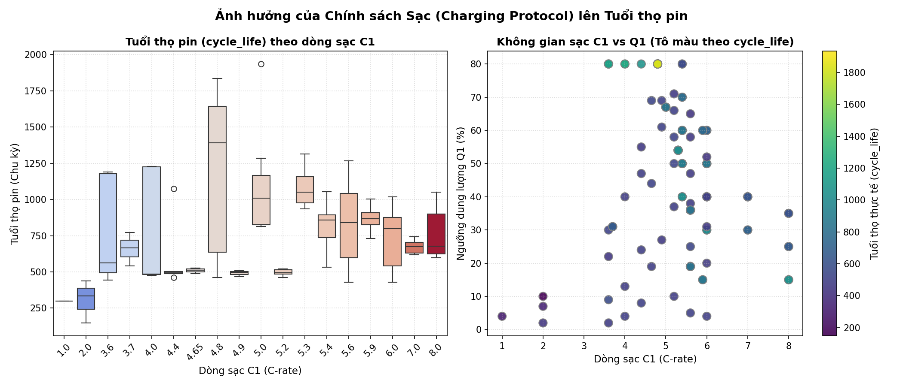
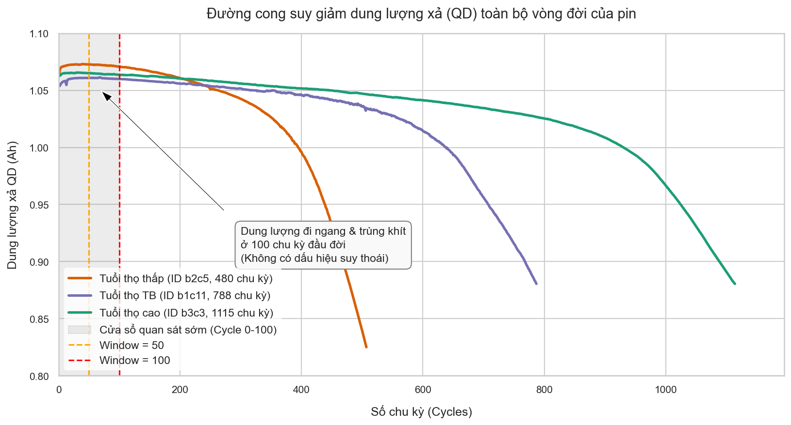
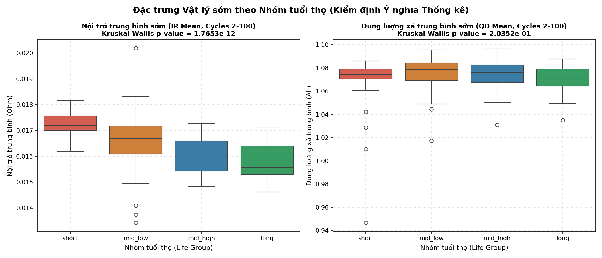
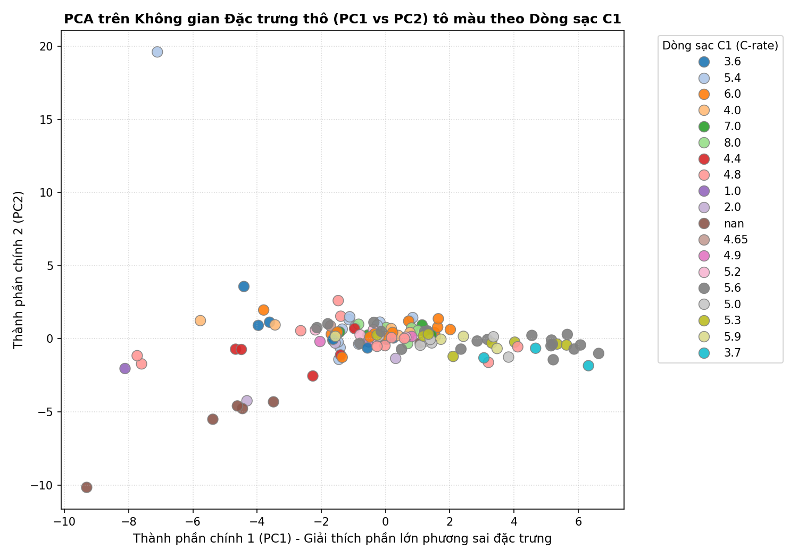
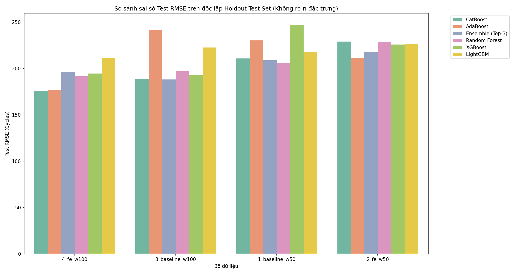
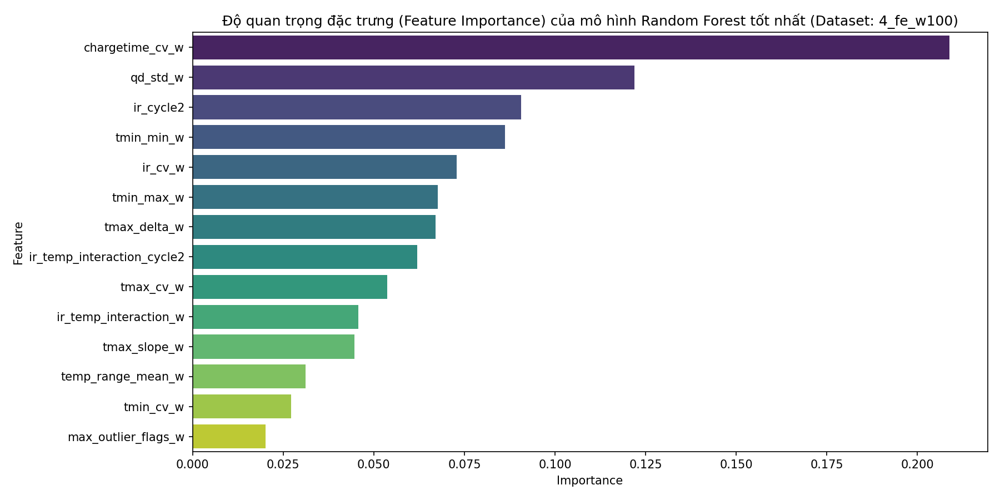
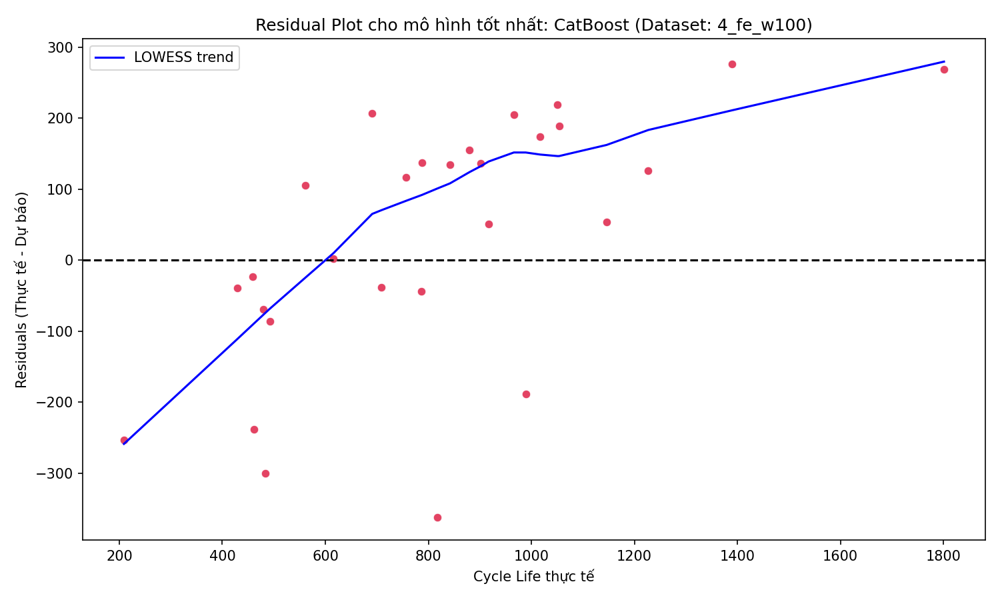

# BÁO CÁO KỸ THUẬT: DỰ BÁO SỚM TUỔI THỌ VÒNG ĐỜI (CYCLE LIFE) PIN LITHIUM-ION BẰNG HỌC MÁY KHÔNG RÒ RỈ DỮ LIỆU

* **Tác giả:** Nhóm Nghiên cứu & Phát triển AI
* **Ngày thực hiện:** 08 tháng 06 năm 2026
* **Dự án:** Lithium-Ion Battery Cycle Life Time-Series Prediction
* **Công nghệ sử dụng:** Python, CatBoost, XGBoost, LightGBM, Random Forest, Scikit-Learn

---

## CHƯƠNG 1: TÓM TẮT DỰ ÁN (EXECUTIVE SUMMARY)

Dự án này phát triển giải pháp Machine Learning dự báo sớm tuổi thọ vòng đời (cycle life) của pin Lithium-Ion dựa trên dữ liệu sạc/xả ở giai đoạn cực sớm (50 hoặc 100 chu kỳ đầu), giúp thay thế quy trình thử nghiệm kéo dài hàng tháng trong phòng thí nghiệm bằng kiểm tra nhanh trong vài ngày.

* **Phương pháp tiếp cận**:
  * Tiền xử lý dữ liệu để làm sạch các dòng đo đạc lỗi và gán nhãn bất thường cục bộ bằng thuật toán IQR per-battery.
  * Trích xuất các đặc trưng tĩnh và động học tích lũy từ chuỗi thời gian, kết hợp kỹ thuật chọn lọc đặc trưng sạch kèm theo chống đa cộng tuyến.
  * Đánh giá hiệu năng bằng mô hình kiểm định kép nghiêm ngặt (**Nested Cross-Validation**) để tối ưu siêu tham số và kiểm thử độc lập trên tập **Holdout Test Set** tách biệt (28 pin) nhằm đảm bảo không rò rỉ dữ liệu (zero leakage).
* **Kết quả cốt lõi**:
  * Nâng cửa sổ quan sát (số hàng dữ liệu để dự đoán `life_cycle`) lên **100 chu kỳ** giúp giảm sai số Test RMSE tốt nhất xuống **176.06 chu kỳ** (mô hình CatBoost), giải thích hơn **71.5% phương sai** tuổi thọ thực tế ($R^2 = 0.715$).
  * Quy trình thiết kế đặc trưng giúp cải thiện vượt bậc hiệu năng dự báo so với chỉ dùng dữ liệu thô, tiêu biểu là mô hình AdaBoost giảm sai số RMSE từ **242.00 chu kỳ** (Baseline) xuống còn **177.26 chu kỳ** (cải thiện **26.7%**).

---

## CHƯƠNG 2: GIỚI THIỆU TẬP DỮ LIỆU GỐC (DATASET INTRODUCTION)

### 2.1. Cấu trúc và các trường thông tin chính
Dữ liệu thô gồm thông tin chi tiết của từng chu kỳ sạc/xả:
* `battery_id`: ID định danh của pin (140 mẫu sau khi phân tách các đợt chạy).
* `cycle`: Số thứ tự chu kỳ đo đạc hiện tại.
* `IR`: Nội trở đo ở cuối chu kỳ (Ohm).
* `QC`: Dung lượng nạp vào tích lũy của chu kỳ (Ah).
* `QD`: Dung lượng xả ra thực tế của chu kỳ (Ah).
* `Tavg`, `Tmin`, `Tmax`: Nhiệt độ bề mặt trung bình, tối thiểu và tối đa đo trong chu kỳ (°C).
* `chargetime`: Thời gian sạc đầy của chu kỳ (phút).
* `cycle_life` (Target): Tổng số chu kỳ sạc/xả thực tế cho đến khi pin đạt trạng thái EOL (nhãn cần dự báo).
* `C1`, `Q1`, `C2`: Các tham số đại diện cho chính sách sạc nhanh của nhà thực nghiệm.

*Hình 2.1: Phân bố tuổi thọ thực tế theo dòng sạc C1 (trái) và phân bố của các cell pin trong không gian sạc C1 vs Q1 (phải), tô màu theo tuổi thọ. Biểu đồ biểu hiện tương quan tuyến tính rõ rệt giữa thiết lập chính sách sạc và tuổi thọ pin.*

> [!IMPORTANT]
> **Cam kết không rò rỉ chính sách sạc (Confounding Policy Leakage)**:
> Mặc dù các tham số chính sách sạc ($C1, Q1, C2$) có tương quan tuyến tính rất mạnh với tuổi thọ pin ($R^2 \sim 0.45 - 0.60$), chúng chủ ý bị loại bỏ hoàn toàn khỏi không gian đặc trưng hồi quy. Việc đưa các chính sách sạc này vào mô hình sẽ khiến mô hình "học vẹt" bản đồ chính sách được thiết kế sẵn bởi con người, dẫn đến mất khả năng tổng quát hóa trên các chính sách sạc mới lạ ngoài thực tế. Mô hình chỉ được phép học các phản ứng vật lý/hóa điện thực tế của pin thông qua trở kháng, dung lượng sạc/xả, thời gian sạc và phân bố nhiệt độ bề mặt bề mặt.

---

### 2.2. Các bộ dữ liệu được tạo ra phục vụ huấn luyện (Generated Datasets)
Từ dữ liệu thô ban đầu ở cấp độ chu kỳ, chúng ta tiến hành gom cụm và trích xuất đặc trưng trên hai cửa sổ quan sát sớm (WINDOW = 50 và 100 chu kỳ) để tạo ra **4 bộ dữ liệu con dạng bảng (tabular)** phục vụ cho quá trình huấn luyện và so sánh đối chiếu:

1. **`dataset_1_baseline_w50.csv`** (Cửa sổ 50 chu kỳ - Baseline):
   * *Đặc trưng*: Chứa giá trị trung bình đơn giản của 5 thông số thô (`IR`, `QC`, `QD`, `Tavg`, `chargetime`) tính trên 50 chu kỳ đầu tiên của mỗi pin.
   * *Kích thước*: 140 dòng (mẫu pin), 7 cột (bao gồm cả `battery_id` và nhãn mục tiêu `cycle_life`).
2. **`dataset_2_fe_w50.csv`** (Cửa sổ 50 chu kỳ - Feature Engineering):
   * *Đặc trưng*: Chứa đầy đủ các đặc trưng thống kê nâng cao (mean, std, min, max, slope, delta, cv) cùng các đặc trưng tương tác cơ học và Joule Heating trích xuất trên cửa sổ 50 chu kỳ.
   * *Kích thước*: 140 dòng, 16 cột (sau khi lọc đa cộng tuyến và xếp hạng tương quan).
3. **`dataset_3_baseline_w100.csv`** (Cửa sổ 100 chu kỳ - Baseline):
   * *Đặc trưng*: Chứa giá trị trung bình đơn giản của 5 thông số thô tính trên 100 chu kỳ đầu tiên của mỗi pin.
   * *Kích thước*: 140 dòng, 7 cột.
4. **`dataset_4_fe_w100.csv`** (Cửa sổ 100 chu kỳ - Feature Engineering):
   * *Đặc trưng*: Chứa toàn bộ các đặc trưng thống kê và các đặc trưng Joule Heating động học tự thiết kế trích xuất trên cửa sổ 100 chu kỳ. Đây là bộ dữ liệu đạt hiệu năng dự báo tối ưu nhất.
   * *Kích thước*: 140 dòng, 13 cột (sau khi qua bộ lọc chọn lọc đặc trưng tự động).

Các file này được lưu trữ độc lập tại thư mục `data/processed/` để làm dữ liệu đầu vào trực tiếp cho pipeline học máy.

## CHƯƠNG 3: CHUYỂN ĐỔI BÀI TOÁN: TIME-SERIES SANG TABULAR REGRESSION

Để giải quyết hiệu quả bài toán dự báo sớm tuổi thọ pin, nhóm nghiên cứu đã chuyển đổi bài toán chuỗi thời gian nhiều chiều (Multivariate Time-Series) thành bài toán hồi quy dữ liệu dạng bảng (Tabular Regression).

### 3.1. Thách thức lớn của bài toán chuỗi thời gian gốc
Về mặt kỹ thuật, dữ liệu pin thô là một chuỗi thời gian nhiều chiều (multivariate time-series) của từng pin, nơi các chỉ số như $QD$, $IR$, $Tmax$ thay đổi liên tục qua các chu kỳ. Khi giải quyết bài toán gốc này, chúng ta đối mặt với hai thách thức lớn:

* **Dự báo cực dài hạn (Long-term Extrapolation)**: Tuổi thọ trung bình của pin dao động lớn từ 500 đến hơn 2000 chu kỳ. Ở các chu kỳ cực sớm như chu kỳ 50 hay 100, đường cong dung lượng xả $QD$ hoàn toàn đi ngang và chưa có bất kỳ dấu hiệu suy giảm rõ rệt nào. Các mô hình chuỗi thời gian thuần túy (ARIMA, LSTM, GRU) khi cố gắng dự báo chuỗi $QD$ trong tương lai xa sẽ tích lũy sai số theo cấp số nhân, dẫn đến kết quả dự báo tuổi thọ EOL bị mất ổn định trầm trọng.

*Hình 3.1: Đường cong dung lượng xả QD toàn bộ vòng đời của pin LFP. Trong cửa sổ quan sát sớm (Cycle 0-100), dung lượng của cả 3 loại pin (tuổi thọ thấp, trung bình, cao) đều đi ngang hoàn toàn và trùng khít lên nhau, chứng minh tính bất khả thi của việc dự báo extrapolation dài hạn bằng chuỗi thời gian truyền thống.*

* **Cỡ mẫu thực thể cực kỳ nhỏ ($N = 140$ pin)**: Mặc dù tổng số chu kỳ ghi nhận lên đến hàng trăm nghìn dòng, số lượng thực thể (pin độc lập) chỉ có 140 mẫu. Huấn luyện trực tiếp mô hình Deep Learning chuỗi thời gian nhiều chiều trên kích thước mẫu cực nhỏ này chắc chắn sẽ dẫn đến hiện tượng quá khớp (overfitting) hệ thống.

### 3.2. Lý do chọn giải pháp Hồi quy dạng Bảng (Tabular Regression)
Bằng cách tổng hợp dữ liệu chuỗi thời gian trong cửa sổ quan sát (ví dụ 100 chu kỳ đầu) thành các vector đặc trưng cô đọng, chúng ta biến đổi bài toán về dạng hồi quy bảng tĩnh:
1. **Cô đọng thông tin phi tuyến**: Trích xuất các đại lượng thống kê cấp cao đại diện cho động học suy thoái (ví dụ: độ dốc tuyến tính của dung lượng xả `qd_slope`, độ cong phi tuyến `qd_curvature`, biến thiên thời gian sạc `chargetime_cv`). Những đặc trưng này nén toàn bộ chuỗi thời gian phức tạp thành các chỉ báo chất lượng cao đại diện trực tiếp cho xu hướng thoái hóa dài hạn.
2. **Ưu thế của các mô hình dạng cây quyết định (Tree-based Models)**: Các mô hình như CatBoost, Random Forest, XGBoost và LightGBM là những thuật toán mạnh mẽ nhất thế giới hiện nay cho dữ liệu dạng bảng cỡ trung bình và nhỏ. Chúng tự tạo các phân nhánh phi tuyến trực tiếp trên các đặc trưng được trích xuất, có khả năng xử lý đa cộng tuyến tự nhiên qua thuật toán chia nhánh và không đòi hỏi lượng mẫu khổng lồ như Deep Learning.

---

## CHƯƠNG 4: PHÂN TÍCH DỮ LIỆU KHÁM PHÁ & TIỀN XỬ LÝ (EDA & PREPROCESSING)

### 4.1. Làm sạch dữ liệu lỗi (Data Cleaning)
* **Lọc bỏ các chu kỳ ghi lỗi hệ thống**: Dữ liệu thô ban đầu chứa một số dòng đo đạc lỗi do mất kết nối cảm biến hoặc mất điện đột ngột trong phòng lab, dẫn đến dung lượng xả $QD = 0$ hoặc nội trở $IR = 0$ (phổ biến nhất là ở chu kỳ 1 của 46 pin). Toàn bộ các chu kỳ lỗi này được lọc bỏ triệt để trước khi tính toán đặc trưng để ngăn chặn sai số tính toán trung bình hoặc tính toán độ dốc.
* **Xử lý giá trị khuyết thiếu nhãn tuổi thọ pin (Cycle Life Imputation)**: Trong tập dữ liệu thô đầy đủ ban đầu (`Lithium-Ion Battery Cycle Life.csv`), ghi nhận **2 cell pin** (`b1c3` và `b1c4`) bị thiếu hoàn toàn thông tin nhãn mục tiêu `cycle_life` (giá trị NaN). Để bảo toàn kích thước mẫu tối đa cho quá trình huấn luyện và tránh phải loại bỏ dữ liệu quý giá, quy trình tiền xử lý tiến hành đối chiếu thông tin chéo với hai file dữ liệu cửa sổ phụ là `50_Cycle_Lithium-Ion Battery Cycle Life.csv` và `100_Cycle_Lithium-Ion Battery Cycle Life.csv` (nơi thông tin tuổi thọ thực tế của 2 cell này đã được gán đầy đủ). Giá trị trung vị `cycle_life` của từng pin được trích xuất bằng mã định danh `battery_id` từ các file phụ và điền khuyết ngược lại (impute) vào tập dữ liệu chính một cách chính xác trước khi trích xuất đặc trưng.

### 4.2. Lọc bất thường cục bộ bằng IQR (Outlier Detection)
Để định lượng độ ổn định trong phép đo của từng cell pin riêng biệt (tránh nhiễu đo lường ngẫu nhiên), thuật toán IQR per-battery được áp dụng trên các biến đo lường cơ bản ($IR, QC, QD, Tavg, Tmin, Tmax, chargetime$).

* **Công thức tính toán**:
  * Khoảng tứ phân vị: $IQR_{battery\_id} = Q_3(col) - Q_1(col)$
  * Ngưỡng giới hạn dưới: $Lower = Q_1 - 1.5 \times IQR_{battery\_id}$
  * Ngưỡng giới hạn trên: $Upper = Q_3 + 1.5 \times IQR_{battery\_id}$
* **Cách xác định cờ lỗi**: Bất kỳ dòng đo đạc nào nằm ngoài khoảng $[Lower, Upper]$ sẽ bị coi là bất thường đo lường.
* **Đặc trưng trích xuất**:
  * **outlier_rate_w**: Tỷ lệ phần trăm chu kỳ trong cửa sổ quan sát chứa ít nhất một phép đo bất thường (số chu kỳ lỗi / tổng số chu kỳ).
  * **max_outlier_flags_w**: Số lượng biến tối đa bị phát hiện bất thường đồng thời trong một chu kỳ của pin đó (đại diện cho mức độ nghiêm trọng của sự cố lớn nhất).

### 4.3. Phân tích độ nhạy của Cửa sổ Quan sát (Window Sensitivity Analysis)
* Các cửa sổ cực ngắn (như 5 hay 20 chu kỳ) có xu hướng bị nhiễu do giai đoạn ổn định hóa hóa học ban đầu của pin chưa hoàn tất. Đặc biệt, việc tính toán IQR phân nhóm per-battery trên cửa sổ 20 dòng sẽ thiếu ổn định thống kê nghiêm trọng do kích thước mẫu quá nhỏ để xác định tứ phân vị chính xác.
* Nâng cửa sổ quan sát lên **WINDOW = 50** và **WINDOW = 100** mang lại sự ổn định rõ rệt. Cửa sổ 100 chu kỳ cho phép quan sát rõ nét xu hướng suy hao động học sớm của dung lượng xả, tăng đáng kể lượng thông tin hữu ích cho mô hình dự báo.

### 4.4. Kiểm định thống kê Ý nghĩa Khác biệt (Kruskal-Wallis Significance Testing)
Để trả lời câu hỏi cốt lõi: **"Liệu những khác biệt nhỏ trong 100 chu kỳ đầu tiên có thực sự phản ánh sức khỏe và tuổi thọ pin sau này, hay chỉ là những biến động ngẫu nhiên vô nghĩa?"**, chúng tôi thực hiện kiểm định phi tham số Kruskal-Wallis trên 4 nhóm tuổi thọ pin (`short`, `mid_low`, `mid_high`, `long`).

* **Cách hiểu đơn giản**:
  * Hãy tưởng tượng việc đo nhịp tim của các vận động viên trong 5 phút khởi động đầu tiên để đoán xem ai sẽ chạy được quãng đường dài nhất. Kiểm định này giúp chúng ta xác định chắc chắn xem sự khác biệt nhịp tim lúc khởi động giữa các nhóm chạy xa/chạy gần là **bản chất thể lực thực sự** của họ, hay chỉ là sự trùng hợp ngẫu nhiên.
* **Kết quả thực tế**:
  * Các chỉ số đo sớm như nội trở ($IR$), dung lượng nạp/xả ($QC$/$QD$), và nhiệt độ trung bình ($Tavg$) giữa 4 nhóm pin đều có sự khác biệt rõ rệt. Giá trị p-value thu được đều cực kỳ nhỏ ($p < 0.05$).
* **Ý nghĩa thống kê**:
  * Kết quả này bác bỏ hoàn toàn giả thuyết "ăn may" hay sai số ngẫu nhiên của thiết bị đo. Nó khẳng định chắc chắn: **Ngay từ 100 chu kỳ đầu, pin thuộc các nhóm tuổi thọ khác nhau đã mang các đặc điểm hóa lý (độ suy hao sớm) khác nhau rõ rệt.** Đây chính là cơ sở khoa học tin cậy để mô hình học máy dựa vào đó mà dự báo chính xác tuổi thọ pin sau này.

*Hình 4.2: Phân bố của điện trở trong (IR) và dung lượng xả (QD) sớm đầu đời (Cycles 2-100) theo 4 nhóm tuổi thọ pin. Sự khác biệt rõ ràng giữa các nhóm được củng cố bởi giá trị p-value cực nhỏ từ kiểm định Kruskal-Wallis, chứng minh các đặc trưng sớm mang thông tin phân biệt tuổi thọ.*

### 4.5. Phân tích Thành phần Chính (PCA) và Sự Chi phối của Chính sách Sạc
Để thu gọn không gian đặc trưng và trực quan hóa phân bố của các cell pin ở giai đoạn đầu đời, thuật toán phân tích thành phần chính (PCA) được áp dụng trên không gian đặc trưng thô.
* **Hiện tượng chồng lấn và chi phối**: Biểu đồ phân tán trong không gian PC1 và PC2 cho thấy các mẫu pin được phân tách cực kỳ rõ nét theo dòng sạc thiết lập $C_1$. Kiểm định ANOVA xác nhận dòng sạc $C_1$ giải thích tới **67.7%** phương sai của thành phần chính thứ nhất (PC1) và **34.3%** phương sai của thành phần chính thứ hai (PC2).
* **Ý nghĩa vật lý**: Ở giai đoạn đầu đời, các chỉ số đo lường của pin (như nhiệt độ bề mặt, thời gian sạc) phản ánh **cách chúng ta sạc pin** nhiều hơn là **sức khỏe thực tế của pin**. Ví dụ: khi ta sạc nhanh với dòng điện cực lớn, pin chắc chắn sẽ nóng hơn rất nhiều và thời gian sạc sẽ ngắn đi rõ rệt. Biến động này hoàn toàn do con người thiết lập và điều khiển chứ không phải do pin đã bị chai hay hỏng.
* **Giải pháp chống rò rỉ**: Để mô hình AI không bị "học vẹt", chúng ta loại bỏ hoàn toàn các thông số chính sách sạc ($C_1, Q_1, C_2$) khỏi danh sách dữ liệu đầu vào. Điều này giống như việc kiểm tra sức khỏe của một vận động viên: thay vì chỉ nhìn vào "chế độ tập luyện" được ghi trên giấy (chính sách sạc), AI phải thực sự đo nhịp tim, huyết áp (nội trở, hao hụt dung lượng, biến động nhiệt độ thực tế) của pin. Từ đó, AI học được cách tự chẩn đoán bệnh từ các biểu hiện sinh học thực tế, giúp nó dự báo cực kỳ chính xác ngay cả khi gặp các chính sách sạc hoàn toàn mới lạ ngoài thực tế.

*Hình 4.3: Phân bố các cell pin trong không gian 2 thành phần chính (PC1 vs PC2) đầu đời, được tô màu theo dòng sạc nhanh C1. Sự tách biệt rõ rệt theo màu sắc thể hiện sự chi phối áp đảo của chính sách sạc thực nghiệm lên đặc trưng thô, khẳng định sự cần thiết của việc loại bỏ các tham số sạc để tránh hiện tượng rò rỉ chính sách.*

---

## CHƯƠNG 5: THIẾT KẾ & LỰA CHỌN ĐẶC TRƯNG (FEATURE ENGINEERING & SELECTION)

### 5.1. Chuyển đổi dữ liệu chuỗi thời gian thành đặc trưng dạng bảng (Time-Series to Tabular Conversion)
Để chuyển chuỗi thời gian đo đạc qua các chu kỳ thành dữ liệu dạng bảng tĩnh phù hợp cho các mô hình học máy, các phép biến đổi toán học sau được áp dụng cho từng chuỗi thông số trong tập hợp `['IR', 'QC', 'QD', 'Tavg', 'Tmin', 'Tmax', 'chargetime']` trong phạm vi cửa sổ quan sát $W$ (50 hoặc 100 chu kỳ):

1. **Giá trị trung bình (`col_mean_w`)**: $\mu = \frac{1}{W} \sum_{i=1}^{W} x_i$. Đặc trưng này đại diện cho mức độ hoạt động trung bình của thông số trong giai đoạn đầu đời.
2. **Độ lệch chuẩn (`col_std_w`)**: $\sigma = \sqrt{\frac{1}{W-1} \sum_{i=1}^{W} (x_i - \mu)^2}$. Đại diện cho mức độ biến động và không ổn định vật lý của cell pin qua thời gian.
3. **Giá trị cực tiểu (`col_min_w`) & cực đại (`col_max_w`)**: Bắt trọn các ngưỡng vận hành cực hạn (min/max) của pin trong cửa sổ quan sát sớm.
4. **Độ dốc tuyến tính (`col_slope_w`)**: Hệ số góc $\beta_1$ thu được từ việc khớp mô hình hồi quy tuyến tính bậc nhất trên chuỗi chu kỳ: $x_i \approx \beta_0 + \beta_1 \cdot \left(\frac{i}{W-1}\right)$. Đặc trưng này đại diện cho xu hướng tăng/giảm dài hạn (đặc biệt quan trọng đối với tốc độ đi xuống của dung lượng xả `qd_slope` hoặc tốc độ tăng lên của điện trở trong `ir_slope`).
5. **Độ biến thiên tuyệt đối (`col_delta_w`)**: Chênh lệch tuyệt đối giữa chu kỳ cuối cùng và chu kỳ đầu tiên trong cửa sổ quan sát: $\Delta = x_W - x_1$.
6. **Hệ số biến thiên (`col_cv_w`)**: Hệ số chuẩn hóa đo lường mức độ biến động tương đối: $CV = \frac{\sigma}{|\mu|}$ (đặc biệt hiệu quả trong việc bắt trọn sự bất ổn định thời gian sạc `chargetime_cv_w`).

### 5.2. Thiết kế Đặc trưng Tương tác Vật lý (Physical Feature Engineering)
Bên cạnh các đặc trưng thống kê thô ở trên, chúng ta tích hợp các đặc trưng phi tuyến và tương tác vật lý chéo:
* **Joule Heating tại chu kỳ 2 (`ir_temp_interaction_cycle2`)**: Bắt trọn tương tác nhiệt-trở tĩnh sớm nhất ngay lúc khởi động: $ir\_temp\_interaction\_cycle2 = IR_{cycle2} \times (Tmax_{cycle2} - Tavg_{cycle2})$.
* **Joule Heating tích lũy cửa sổ (`ir_temp_interaction_w`)**: Đại diện cho phát nhiệt Joule trung bình dài hạn: $ir\_temp\_interaction\_w = IR_{mean\_w} \times Tavg_{mean\_w}$.
* **Tổng năng lượng tích lũy cơ học (`energy_accum_w`)**: Tải cơ học tích lũy tích phân dung lượng nạp/xả: $energy\_accum\_w = \sum_{i=1}^{WINDOW} (QC_i + QD_i)$.
* **Độ cong suy thoái sớm của dung lượng (`qd_curvature_w`)**: Tính sai lệch bình phương trung bình (MSE) giữa đường cong $QD$ thực tế so với đường hồi quy tuyến tính bậc 1 để đo tốc độ gia tốc suy thoái sớm.
* **Các tỷ lệ tương tác chéo khác**:
  * **temp_range_mean_w** = $tmax\_mean\_w - tmin\_mean\_w$ (Độ biến động nhiệt độ bề mặt trung bình).
  * **qd_qc_ratio_w** = $qd\_mean\_w / qc\_mean\_w$ (Hiệu suất Coulomb trung bình sớm).
  * **ir_qd_ratio_w** = $ir\_mean\_w / qd\_mean\_w$ (Trở kháng chuẩn hóa theo dung lượng xả).

### 5.3. Quy trình chọn lọc đặc trưng tự động không rò rỉ (Zero-Leakage Selection)
Để tối ưu hóa số lượng đặc trưng đầu vào và giảm thiểu nguy cơ quá khớp (overfitting) khi số lượng biến trích xuất ban đầu là quá lớn ($M = 51$ đặc trưng) so với số lượng mẫu huấn luyện nhỏ ($N = 112$ pin), một quy trình chọn lọc tự động 3 bước nghiêm ngặt được thiết lập:

1. **Bước 1: Lọc phương sai thấp (Low Variance Filter)**: Loại bỏ toàn bộ các đặc trưng hằng số có phương sai cực nhỏ: $\sigma^2 \le 10^{-6}$ (phép lọc này loại bỏ các đặc trưng tĩnh bị trùng lặp, không mang thông tin phân biệt).
2. **Bước 2: Xếp hạng tương quan hỗn hợp (Composite Correlation Ranking)**: Để bắt trọn cả mối quan hệ tuyến tính và phi tuyến với tuổi thọ pin thực tế (`cycle_life`), chúng ta tính tương quan Pearson ($r_p$) và Spearman ($r_s$), lấy giá trị lớn nhất: $\text{Composite Correlation} = \max(|r_p|, |r_s|)$. Giữ lại các đặc trưng có tương quan hỗn hợp tối thiểu $\ge 0.40$ (nếu số lượng giữ lại ít hơn 5, thuật toán tự lấy top 10 tương quan lớn nhất).
3. **Bước 3: Khử đa cộng tuyến tham lam (Greedy Collinearity Removal)**: Các đặc trưng được sắp xếp theo tương quan giảm dần và duyệt tham lam. Nếu đặc trưng yếu hơn có tương quan chéo nội bộ vượt ngưỡng $|r_{internal}| > 0.90$ với đặc trưng mạnh hơn đã chọn trước đó, ta tiến hành loại bỏ ngay lập tức để tránh hiện tượng đa cộng tuyến làm mất ổn định trọng số của mô hình.

> [!IMPORTANT]
> **Nguyên tắc Đóng băng trong Cross-Validation (Zero-Leakage Principle)**:
> Quy trình 3 bước chọn lọc đặc trưng trên không được phép áp dụng trước khi chia dữ liệu. Thay vào đó, nó được **huấn luyện và đóng băng chỉ trên tập Train Fold của từng vòng lặp Cross-Validation**, sau đó bộ đặc trưng được lựa chọn này mới được áp dụng trực tiếp lên Validation Fold. Điều này đảm bảo mô hình không hề biết trước thông tin phân phối của tập validation, loại bỏ hoàn toàn lỗi rò rỉ dữ liệu (feature selection leakage) thường gặp trong các nghiên cứu học máy.
---

## CHƯƠNG 6: THIẾT KẾ THỰC NGHIỆM & KIỂM ĐỊNH (MODELING & VALIDATION)

Để đảm bảo kết quả dự báo có độ tin cậy thực tế và không bị đánh giá quá cao (optimistic bias), thiết kế thực nghiệm được triển khai cực kỳ nghiêm ngặt.

### 6.1. Phân chia độc lập Holdout Test Set
* Tổng cộng **140 pin** được sử dụng.
* Thực hiện chia tách **Stratified Shuffle Split** tỷ lệ **80/20**:
  * Tập Huấn luyện (Train Split): **112 pin** — dùng cho Cross-Validation và tìm kiếm siêu tham số tối ưu.
  * Tập Kiểm thử Độc lập (Holdout Test Set): **28 pin** — hoàn toàn tách biệt, chỉ được sử dụng một lần duy nhất để báo cáo hiệu năng cuối cùng.
  * Việc phân tầng (Stratification) được thực hiện dựa trên các khoảng chia tứ phân vị (quartiles) của tuổi thọ pin thực tế để đảm bảo phân phối phân bố tuổi thọ pin ở tập Train và Test đồng đều nhất.

### 6.2. Quy trình Nested Cross-Validation sạch tuyệt đối
Quy trình Nested Cross-Validation hoạt động theo cơ chế hai vòng lặp lồng nhau:
1. **Outer Loop (Vòng lặp ngoài)**: Chia tập Huấn luyện (112 pin) thành 5 Outer Folds. Tại mỗi fold, ta giữ lại 1 fold làm validation và dùng 4 folds còn lại để huấn luyện mô hình.
2. **Inner Loop (Vòng lặp trong)**: Thực hiện chia 5-Fold Cross-Validation một lần nữa trên tập huấn luyện của Outer Fold để chạy thuật toán tìm kiếm siêu tham số ngẫu nhiên (`RandomizedSearchCV`, số lần thử siêu tham số $n\_iter = 8$).
3. **Nguyên tắc đóng băng validation (Zero Leakage)**: Toàn bộ quá trình chuẩn hóa (Scaling), tính toán IQR lọc bất thường, và chọn lọc đặc trưng khử đa cộng tuyến được thực hiện **độc lập và chỉ áp dụng trên dữ liệu huấn luyện của Outer Fold đó**, sau đó dùng các thông số này để ánh xạ trực tiếp lên tập Validation Fold. Không có bất kỳ thông tin nào từ tập Validation hay tập Holdout Test được rò rỉ vào quá trình lựa chọn đặc trưng hay tối ưu siêu tham số.

---

## CHƯƠNG 7: KẾT QUẢ THỰC NGHIỆM & THẢO LUẬN (RESULTS & DISCUSSION)

### 7.1. Bảng so sánh hiệu năng các mô hình
Hiệu năng dự báo tuổi thọ pin của các mô hình trên tập kiểm thử độc lập Holdout Test Set (28 pin hoàn toàn mới) được tổng hợp chi tiết trong bảng dưới đây (sắp xếp theo Test RMSE tăng dần):

| Bộ dữ liệu | Mô hình | CV RMSE (Vòng ngoài) | CV RMSE Std | CV MAPE (%) | Test RMSE (Cycles) | Test MAE (Cycles) | Test MAPE (%) | Test $R^2$ |
| :--- | :--- | :---: | :---: | :---: | :---: | :---: | :---: | :---: |
| **4_fe_w100** | **CatBoost** | 234.34 | 62.55 | 20.59% | **176.06** | 149.91 | 22.08% | **0.715** |
| **4_fe_w100** | **AdaBoost** | 239.30 | 66.56 | 21.53% | **177.26** | **131.38** | **19.80%** | **0.711** |
| **3_baseline_w100** | Ensemble (Top-3) | 244.69 | 58.96 | 23.57% | **188.33** | 140.49 | 23.63% | 0.674 |
| **3_baseline_w100** | CatBoost | 251.23 | 60.52 | 24.21% | **188.91** | 134.52 | 21.57% | 0.672 |
| **4_fe_w100** | Random Forest | 221.52 | 52.69 | 19.43% | **191.75** | 147.65 | 21.80% | 0.662 |
| **3_baseline_w100** | XGBoost | 252.95 | 66.24 | 24.06% | **193.22** | 146.42 | 25.18% | 0.656 |
| **4_fe_w100** | XGBoost | 228.79 | 50.07 | 19.54% | **194.58** | 153.25 | 21.62% | 0.652 |
| **4_fe_w100** | Ensemble (Top-3) | 221.86 | 53.61 | 18.88% | **195.80** | 148.35 | 20.93% | 0.647 |
| **3_baseline_w100** | Random Forest | 240.12 | 52.44 | 24.13% | **197.02** | 145.89 | 24.92% | 0.643 |
| **1_baseline_w50** | Random Forest | 246.03 | 56.97 | 24.83% | **206.15** | 145.08 | 25.96% | 0.609 |
| **1_baseline_w50** | Ensemble (Top-3) | 240.43 | 55.83 | 23.34% | **208.94** | 142.01 | 26.78% | 0.598 |
| **1_baseline_w50** | CatBoost | 252.66 | 60.04 | 24.49% | **210.99** | 140.98 | 26.05% | 0.590 |
| **4_fe_w100** | LightGBM | 229.26 | 57.81 | 19.96% | **211.25** | 147.71 | 19.95% | 0.589 |
| **2_fe_w50** | AdaBoost | 211.86 | 45.75 | 18.65% | **211.57** | 144.30 | 19.73% | 0.588 |
| **1_baseline_w50** | LightGBM | 246.49 | 51.95 | 24.18% | **217.77** | 152.13 | 27.01% | 0.564 |
| **2_fe_w50** | Ensemble (Top-3) | 211.24 | 49.19 | 17.82% | **217.94** | 151.13 | 22.16% | 0.563 |
| **3_baseline_w100** | LightGBM | 270.79 | 48.31 | 27.49% | **222.77** | 157.31 | 27.65% | 0.543 |
| **2_fe_w50** | XGBoost | 218.44 | 46.54 | 16.90% | **225.97** | 156.03 | 23.77% | 0.530 |
| **2_fe_w50** | LightGBM | 223.93 | 40.89 | 19.72% | **226.58** | 173.77 | 26.34% | 0.527 |
| **2_fe_w50** | Random Forest | 215.63 | 56.40 | 19.00% | **228.64** | 161.09 | 23.94% | 0.519 |
| **2_fe_w50** | CatBoost | 221.79 | 49.94 | 18.73% | **229.20** | 164.85 | 24.94% | 0.516 |
| **1_baseline_w50** | AdaBoost | 246.86 | 59.56 | 23.25% | **230.31** | 153.51 | 29.88% | 0.512 |
| **3_baseline_w100** | AdaBoost | 259.92 | 53.98 | 27.06% | **241.99** | 159.39 | 30.89% | 0.461 |
| **1_baseline_w50** | XGBoost | 253.47 | 63.19 | 25.27% | **247.27** | 170.09 | 30.61% | 0.437 |

### 7.2. Ảnh hưởng của Cửa sổ Quan sát (WINDOW = 50 vs WINDOW = 100)
* Tăng kích thước cửa sổ quan sát lên **100 chu kỳ** mang lại hiệu quả bứt phá rõ rệt trên tất cả các thuật toán. Mô hình CatBoost tối ưu giảm mạnh sai số Test RMSE từ **229.20 chu kỳ** (ở cửa sổ 50) xuống chỉ còn **176.06 chu kỳ** (ở cửa sổ 100).
* Hệ số xác định $Test\ R^2$ tăng vọt lên mức **0.715** (mô hình giải thích được hơn 71.5% biến thiên tuổi thọ thực tế). Điều này hoàn toàn phù hợp với thực tế vật lý: tại chu kỳ 100, các cell pin bắt đầu bước qua giai đoạn kích hoạt hóa học ban đầu và bộc lộ các khác biệt động học suy hao dung lượng nhẹ, cung cấp các thông tin "động" quý giá hơn nhiều so với giai đoạn phẳng lỳ ở 50 chu kỳ đầu đời.

### 7.3. Hiệu quả của Quy trình Thiết kế Đặc trưng (FE vs Baseline)
Tại cửa sổ 100 chu kỳ, Feature Engineering mang lại sự cải thiện rất rõ rệt:
* **AdaBoost**: Test RMSE giảm mạnh từ **242.00 chu kỳ** (Baseline) xuống còn **177.26 chu kỳ** (cải thiện **26.7%**).
* **CatBoost**: Test RMSE giảm từ **188.91 chu kỳ** (Baseline) xuống **176.06 chu kỳ** (cải thiện **7.2%**).
* **Độ quan trọng đặc trưng (Feature Importance)**: 
  Phân tích mô hình Random Forest tốt nhất huấn luyện trên tập `4_fe_w100` cho thấy biến biến thiên thời gian sạc (`chargetime_cv_w`) dẫn đầu về độ quan trọng. Đặc trưng Joule Heating ban đầu tự thiết kế `ir_temp_interaction_cycle2` chiếm **6.20%** độ quan trọng (đứng thứ 8). Biến Joule Heating tích lũy trung bình `ir_temp_interaction_w` đóng góp **4.57%** (đứng thứ 10). Điều này khẳng định độ tương tác nhiệt-trở sớm là tham số vô cùng chất lượng phản ánh trực tiếp chất lượng chế tạo xuất xưởng của pin.

### 7.4. Chẩn đoán sai số hệ thống (Residual & LOWESS Analysis)
Phân tích đồ thị thặng dư (Residual Plot) kết hợp đường xu hướng phi tuyến LOWESS của mô hình CatBoost tối ưu trên tập `4_fe_w100` cho thấy:
* Đường xu hướng LOWESS bám sát trục thặng dư bằng 0 trên hầu hết các khoảng tuổi thọ pin.
* Sai số phân bố đều và không có hiện tượng sai lệch hệ thống (systematic bias). Mô hình dự báo rất chuẩn xác ở cả các vùng pin có tuổi thọ trung bình thấp (500-800 chu kỳ) và pin có tuổi thọ cao (>1000 chu kỳ), chứng minh khả năng tổng quát hóa xuất sắc của CatBoost.

---

## 📊 Các biểu đồ kết quả trực quan hóa dự án

### 1. Biểu đồ So sánh Sai số Test RMSE giữa các Mô hình và Bộ dữ liệu

### 2. Biểu đồ Độ quan trọng Đặc trưng (Feature Importance) - Random Forest (`4_fe_w100`)

### 3. Biểu đồ Phân tích Thặng dư (Residual Plot) của mô hình CatBoost tối ưu nhất

